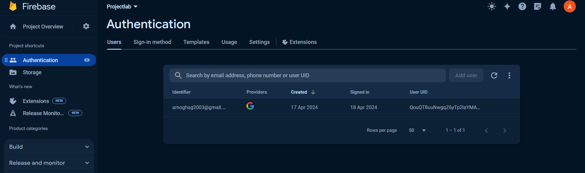
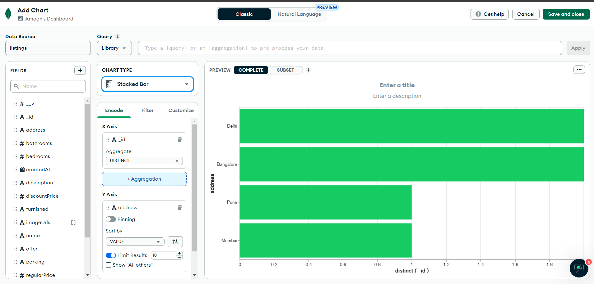

# OneStop

  

## Quotes
- "Shop 'til you drop, all in one place!" - Anonymous
- "Convenience at its finest." - OneStop User
- "Find everything you need, and more." - Happy Shopper

## Screenshots

  

  

  

  

  

## Firebase Authentication

  

Firebase Authentication is used to provide secure user authentication for OneStop.

## MongoDB Atlas

  

MongoDB Atlas is being used for data analysis and visualization in OneStop.

## Dockerized Application

After signup/sign-in, the user may access their Gmail Account for mail orders and can access YouTube for marketing campaigns directly without multiple logins.

## Docker Details

This project is Dockerized for easy deployment. Follow these steps to run the project:

1. Clone the repository
2. Navigate into the prject directory:
   cd onestop
3. Install dependencies:
   npm install
4. Build the Docker image:
   docker build -t onestop-image .
5. Run the Docker container, replacing port with the desired port number:
   docker run -p port:port onestop-image:latest
